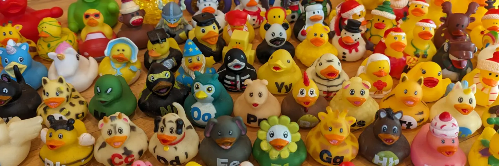

Well, hello there! 👋🏻

I'm Jeremy, a full-quack developer with over 11 years of experience, and
aspiring human being with nearly 40 years of experience. I'm always learning and
tinkering, whether it's doing stuff with code, building things with wood, or
telling stories with my writing.

I'm passionate about accessibility, and believe the web is for everyone.
Likewise for education. I believe that everyone has something to teach.

Things I Am:

- polyglot
- craftsperson
- [insert third thing here]

Things I Am Not:

- tall
- cilantro enthusiast
- your dad? 🤨

I'm also an enthusiastic collaborator. So if you'd like to pair on a project, or
share some code ideas, send a message my way!
